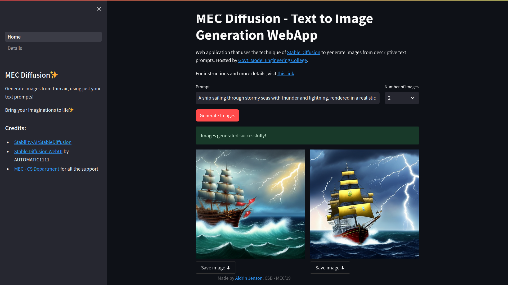

# Simple-Stable-Diffusion

A minimalist and opinionated web user interface (UI) for image generation using the Stable Diffusion. It provides a slick and modern theme to enhance the image generation experience. The project allows users to connect to an existing Stable Diffusion backend by setting the API_URL in the .env file, making it easy to use and integrate into your image generation workflow.



[Demo Video](./misc/simple-stable-diffusion-demo.mp4)

## Features

- Image generation using Stable Diffusion.
- Display of quotes from famous people while images are being generated (during the waiting time).
- Adjustable number of images to be generated.
- Download generated images locally.
- Everything is generated in markdown for seamless integration with other projects.
- Optional NEGATIVE_PROMPT in the .env file to be applied to all generated images.

## Live Version

Check out the live version of Simple-Stable-Diffusion-UI hosted at https://diffusion.mec.ac.in/.

## Installation

To use Simple-Stable-Diffusion-UI, follow these installation instructions:

1.  Clone the repository from GitHub:

```bash
git clone https://github.com/your-username/Simple-Stable-Diffusion-UI.git
cd Simple-Stable-Diffusion-UI
```

2. Install the required dependencies:

```bash
pip install -r requirements.txt
```

3.  Set up the environment variables:

Create a .env file in the root of the project and set the following variables:

```env
API_URL=<your_stable_diffusion_backend_url>
NEGATIVE_PROMPT=<optional_negative_prompt>
```

Replace <your_stable_diffusion_backend_url> with the URL of your existing Stable Diffusion backend, and <optional_negative_prompt> with any negative prompt you want to apply to all generated images.

4.  Run the Streamlit app:

```bash
streamlit run Home.py
```

The app will be running locally at http://localhost:8501. Open the URL in your web browser to access the Simple-Stable-Diffusion-UI.

## Credits

- Stability-AI/StableDiffusion - The Stable Diffusion technology used as the backend.
- AUTOMATIC1111 - Original developer of the Stable Diffusion WebUI.
